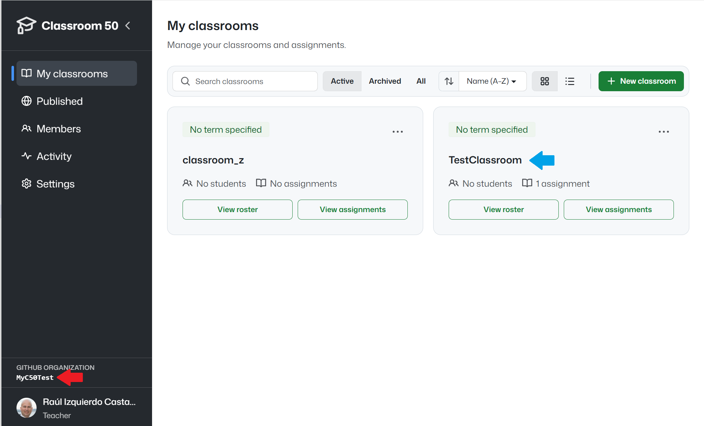

# Teams50

## What is this application in a nutshell?

It is a small CLI application that helps teachers create and update GitHub teams, where each team represents a lab group.

This tool is implemented in Java and requires JDK 21 or later.

> **Note:** This application is part of a toolkit for managing classrooms created with [Classroom50](http://github.com/raul-izquierdo/classroom50). We strongly recommend reading the [main toolkit repository](https://github.com/raul-izquierdo/classroom-50-tools) first to get an overview of the project and understand where this application fits.

## Who is this for?

This tool is intended for instructors using the [Classroom 50](https://github.com/foundation50/classroom50/wiki) platform. That platform handles assignment submission and collection, but it does not manage the later delivery of exercise solutions.

_teams50_ is designed for teachers who want to distribute solutions group by group during the course. To do that, they need to create one team for each lab group so they can grant them access to the solutions repositories or to any other repository on GitHub.

## The Problem

At the beginning of the course, the teacher has to create the teams and assign each student one by one using the GitHub web interface. To do this, they need each student's GitHub _username_ (email alone is not enough). This information is usually not available to the teacher, because each student has their own personal GitHub account. Therefore, it must be gathered before they can be invited to the teams.

Once that obstacle has been overcome, the teacher must keep the teams up to date throughout the course. Especially at the start of the term, it is common for students to enroll, leave, or change lab groups. Each time this happens, the teacher has to inspect the _Classroom 50_ roster and determine what needs to be updated in each GitHub team, which is tedious and error-prone.

## How does the app simplify this process?

_teams50_ automates the whole process without requiring teacher intervention:
- It connects to Classroom 50 to fetch the student roster, including each student's GitHub _username_ and lab group (called a _section_ in Classroom 50).
- It uses that information to determine whether new teams need to be created for newly formed groups.
- It updates the teams to reflect enrollments, drops, and group changes that have occurred during the course.

Once the teams are created, they can be used to grant students access to solutions by group. This can be done through the GitHub web interface, or, as recommended, by using [solutions50](https://github.com/raul-izquierdo/solutions50), the companion tool in this toolkit that handles this task.

## Installation

> ⚠️ This section is for those who want to use this tool independently. If you are going to use it together with the rest of the toolkit (recommended), follow the instructions in the toolkit's [main repository](https://github.com/raul-izquierdo/classroom-50-tools#toolkit-installation). You do not need to repeat these steps because they are already included there.

Download [teams50.jar](https://github.com/raul-izquierdo/teams50/releases/latest/download/teams50.jar) from the latest release of this repository.

To verify that it works, run the _version_ or _help_ command:

```bash
java -jar teams50.jar -V
```

```bash
java -jar teams50.jar -h
```

## Configuration

> ⚠️ This section is for those who want to use this tool independently. If you are going to use it together with the rest of the toolkit (recommended), follow the instructions in the toolkit's [main repository](https://github.com/raul-izquierdo/classroom-50-tools#toolkit-configuration). You do not need to repeat these steps because they are already included there.

1. (Optional) Create a `.env` file with the required environment variables.

    ```env
    CLASSROOM_NAME=<name of the Classroom 50 classroom>
    CLASSROOM_ORG=<organization associated with the Classroom 50 instance>
    SOLUTIONS_ORG=<organization that contains the repositories with the solutions>
    GITHUB_TOKEN=<GitHub token - see below for instructions>
    ```

    This step is optional but strongly recommended, as it allows you to run _solutions50_ without specifying command-line flags. If you prefer not to create it, make sure to pass the appropriate command-line arguments.

    Here's how to obtain the values for the variables above:
    - `CLASSROOM_NAME` and `CLASSROOM_ORG` can be obtained from the Classroom 50 web interface. The tools in this toolkit assume that a classroom has already been created and that you have access to it. If you have not created a classroom yet, please do so before proceeding.

        In the following image, the `CLASSROOM_ORG` is indicated by the red arrow, and the `CLASSROOM_NAME` by the blue arrow.
        

    - `SOLUTIONS_ORG` is the organization where the **teams should be created**. This may differ from the organization linked to Classroom 50. Some instructors prefer storing solutions in a separate organization from assignments (recommended). In that case, specify the organization containing the solutions here. Otherwise, you can use the same organization as `CLASSROOM_ORG`.
    - `GITHUB_TOKEN` should contain a GitHub personal access token with the `repo` and `admin:org` scopes. See the [GitHub documentation: Creating a personal access token](https://docs.github.com/en/authentication/keeping-your-account-and-data-secure/managing-your-personal-access-tokens#creating-a-personal-access-token-classic) for instructions.

## When to run _teams50_

To add a member to a _team_, GitHub requires a _username_, which _teams50_ also needs. This information is not initially available in the Classroom 50 roster when students are added by email. However, Classroom 50 automatically adds each student's GitHub _username_ to the roster once they **accept the invitation** to join the classroom.

Ideally, _teams50_ should therefore be run after all students have accepted the invitation. In practice, however, some students may never accept it. After allowing a reasonable amount of time for students to accept their invitations, you can run _teams50_ to add the students who have already accepted to their respective groups.

In any case, you can run _teams50_ as often as needed. Each run adds to the appropriate groups any students who have accepted the invitation since the previous run.

## Using the Application

To run the application, execute the following command in a terminal:

```bash
java -jar teams50.jar
```

This downloads the current classroom roster from Classroom 50 and ensures that the teams in the organization storing the solutions are synchronized with the lab groups in the roster.
- Keep in mind that GitHub will send an email to the student **inviting** them to join the _team_. If they do not accept the invitation, they will not be added to the _team_ and will not have access to the solutions.

> **Note:** This process only applies to students who have accepted the invitation to join the classroom and therefore already have a _username_ in the roster.

Run the tool whenever the classroom roster changes or whenever you want to verify that everything is synchronized.

If you want to check what changes would be made without actually performing them, run the tool with the `--dry-run` option. This will display the actions that would be taken without making any changes.

```bash
java -jar teams50.jar --dry-run
```

## Removing Teams

This tool does not delete any _team_ from the organization storing the solutions. If a _team_ is no longer needed, delete it manually through the GitHub web interface.

The organization may contain _teams_ that are not related to lab groups. Therefore, an empty _team_ is not necessarily obsolete. For example, the organization may have a _team_ for instructors or teaching assistants that is not referenced in the roster.

In any case, the tool lists _teams_ that have no students and may therefore be candidates for deletion. This allows the instructor to decide whether to remove them.

## Generated Team Names for Groups

_teams50_ creates _teams_ with exactly the same names as the lab groups (_sections_) in the roster. For example, if a lab group is named `A1`, it creates a _team_ named `A1` without adding a prefix or suffix.

When checking whether a _team_ already exists, _teams50_ ignores capitalization. For example, if a lab group is named `A1` and a _team_ named `a1` already exists, _teams50_ considers the _team_ to exist and does not create a new one. Students in that group can specify their section as either `A1` or `a1`, and they are added to the same _team_.

## Command-Line Arguments

Syntax:

```bash
java -jar teams50.jar [flags]
```

Flags:

- **-r [current_roster.csv]**: Use this local roster file instead of downloading the roster from the Classroom 50 repository. If not provided, the tool will download the current roster from the Classroom 50 GitHub repository.
- **-t [token]**: GitHub API access token. If not provided, it will try to read from the `GITHUB_TOKEN` environment variable or from a `.env` file.
- **-o [organization]**: GitHub organization name associated with the classroom. If not provided, it will try to read from the `CLASSROOM_ORG` environment variable or from a `.env` file.
- **-c [classroom]**: Classroom name. If not provided, it will try to read from the `CLASSROOM_NAME` environment variable or from a `.env` file.
- **-s [solutions-org]**: GitHub organization where the solutions are stored. If not provided, it will try to read from the `SOLUTIONS_ORG` environment variable or from a `.env` file.
- **--dry-run**: Do not perform any changes; only read and print the actions that would be performed.
- **-h, --help**: Show help.
- **-V, --version**: Show version.

## Exit Codes

The exit codes indicate the result of command execution:

- **0**: The command executed successfully.
- **1**: An error occurred.

## License

See `LICENSE`.
Copyright (c) 2025 Raul Izquierdo Castanedo

---
<style>p:has(+ :is(ul,ol)) { margin-bottom: 0; }</style>
